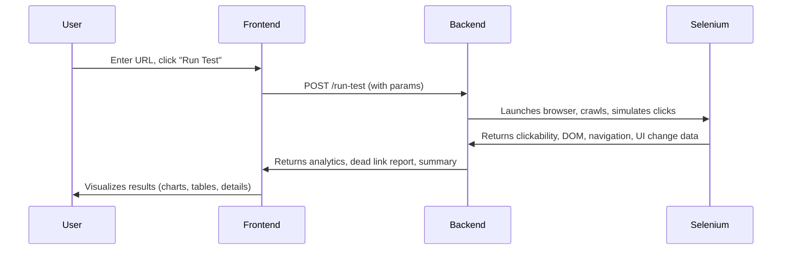
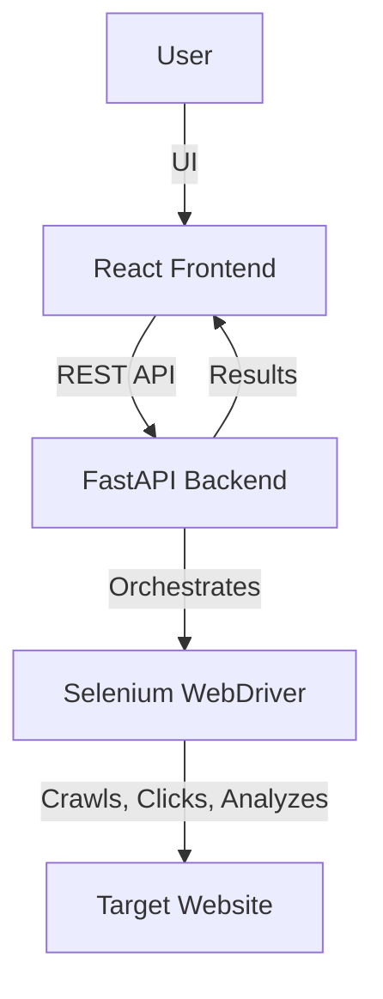

# Web-Crawler: Enterprise Clickability Analytics & Dead Link Finder

## Overview

This project is an enterprise-grade web crawler and clickability analytics tool. It detects dead links, clickability issues, and UI changes on web pages, providing actionable insights via a modern dashboard.

---

## Table of Contents
- [Architecture](#architecture)
  - [High-Level Design (HLD)](#high-level-design-hld)
  - [Low-Level Design (LLD)](#low-level-design-lld)
- [Technologies Used](#technologies-used)
- [Key Features](#key-features)
- [Setup & Usage](#setup--usage)
- [Enterprise-Ready Features](#enterprise-ready-features)
- [Component Diagram](#component-diagram)
- [Contributing](#contributing)
- [License](#license)

---

## Architecture

### High-Level Design (HLD)

- **Frontend:** React + TypeScript dashboard for user interaction and visualization.
- **Backend:** FastAPI (Python) service orchestrating Selenium-based crawling, click simulation, and analytics.
- **Automation:** Uses Selenium WebDriver (Chromium) for browser automation, with advanced evasion and interaction techniques.

#### System Flow



---

### Low-Level Design (LLD)

#### Frontend (React)
- **App.tsx:** Main dashboard, handles user input, triggers backend tests, displays results.
  - URL input, wait time, strictness controls
  - "Run Test" button triggers backend
  - Fetches and displays results (charts, tables)
  - Error and status handling (Snackbar, Alerts)
  - Uses Axios for API calls, Material-UI for UI, Recharts for visualization

#### Backend (FastAPI)
- **main.py:** Entry point, sets up FastAPI app, CORS, and API router.
- **routes/api.py:** Defines API endpoints:
  - `/run-test` (POST): Triggers a new crawl/test
  - `/results` (GET): Fetches last results
  - `/status` (GET): Health check
- **services/test_service.py:** Orchestrates test runs, instantiates ClickableElementTester with parameters.
- **core/click_tester.py:** Core logic for crawling, click simulation, and analytics.
  - `ClickableElementTester`: Main class for crawling and click testing
    - `_setup_driver`: Configures Selenium ChromeDriver with anti-bot options (headless, user-agent, user-data-dir, disables automation flags)
    - `_test_element_click_with_driver`: Simulates clicks, detects navigation, DOM/UI changes, dead clicks
    - `_find_element_by_info_with_driver`: Robust element location (XPath, CSS, ID, text, etc.)
    - `_deep_scan_interactions`: Actively interacts with UI elements (accordion, tabs, dropdowns, etc.)
    - **Akamai Bypass:** Uses real user-agent, disables automation flags, randomizes user-data-dir, and manipulates navigator.webdriver to evade bot detection (Akamai, etc.)
    - **Concurrency:** Uses ThreadPoolExecutor for parallel crawling and testing
    - **DeepCrawler Integration:** Recursively explores nested/hidden clickables, including iframes
- **utils/element_utils.py:** Helper functions for extracting element info, deduplication, status code checks, etc.
- **models/element.py:** Data model for element info (dataclass)

#### Techniques Used
- **Clickability Enhancement:**
  - Multiple strategies to locate and interact with elements (XPath, CSS, ID, text, ARIA, data-testid)
  - Scrolls elements into view, checks for display/enabled state, retries on failure
  - Simulates real user actions (mouse move, click, JS click fallback)
  - Detects UI changes: navigation, DOM mutation, modals, dropdowns
  - Dead click detection: suspicious hrefs, no visible effect, error handling
- **Akamai/Bot Detection Bypass:**
  - Custom user-agent
  - Disables Selenium automation flags
  - Randomizes Chrome user-data-dir
  - Sets navigator.webdriver to undefined
  - Headless mode with anti-detection tweaks
- **Concurrency & Performance:**
  - ThreadPoolExecutor for parallel element testing
  - Batching and pooling of browser instances
- **Extensibility:**
  - Modular design (services, core, utils, models)
  - Easy to add new detection strategies or UI analytics

---

## Technologies Used

- **Frontend:** React, TypeScript, Material-UI, Recharts, Axios
- **Backend:** FastAPI, Selenium, ThreadPoolExecutor, Python 3, Uvicorn
- **Other:** CORS, REST API, concurrent crawling, Akamai bot detection bypass

---

## Key Features
- Enterprise-grade clickability analytics
- Dead link and UI change detection
- Akamai/bot detection bypass via Selenium tweaks
- Modern dashboard with charts and tables
- Extensible, modular backend and frontend
- REST API for integration
- Concurrency for performance

---

## Setup & Usage

### Backend
1. Create and activate a Python virtual environment:
   ```bash
   python3 -m venv .venv
   source .venv/bin/activate
   ```
2. Install dependencies:
   ```bash
   pip install -r backend/requirements.txt
   ```
3. Run the backend server:
   ```bash
   python backend/main.py
   ```
   The API will be available at http://localhost:8000

### Frontend
1. Install dependencies:
   ```bash
   cd frontend
   npm install
   ```
2. Start the frontend server:
   ```bash
   npm start
   ```
   The dashboard will be available at http://localhost:3000

---

## Enterprise-Ready Features
- **Scalable:** Threaded crawling, modular codebase, REST API
- **Secure:** CORS, environment-based config, no hardcoded secrets
- **Extensible:** Add new analytics, UI checks, or integrations easily
- **Presentation-Ready:** Modern dashboard, exportable results, clear error/status reporting

---

## Component Diagram



---

## Contributing
Pull requests are welcome! For major changes, please open an issue first to discuss what you would like to change.

---

## License
[MIT](LICENSE)